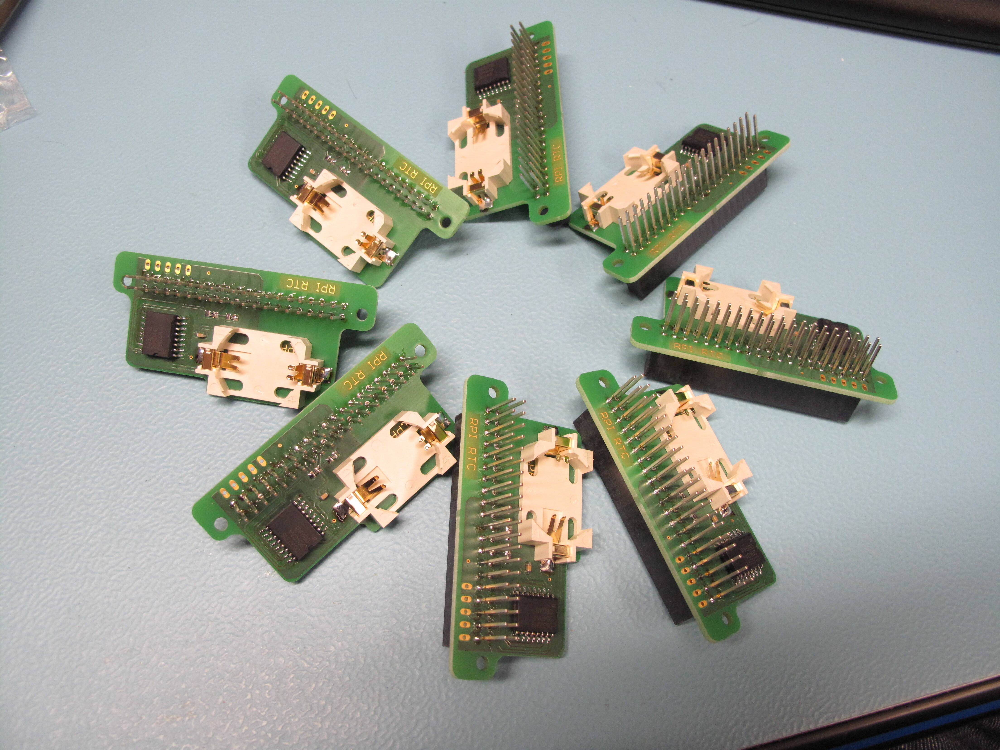
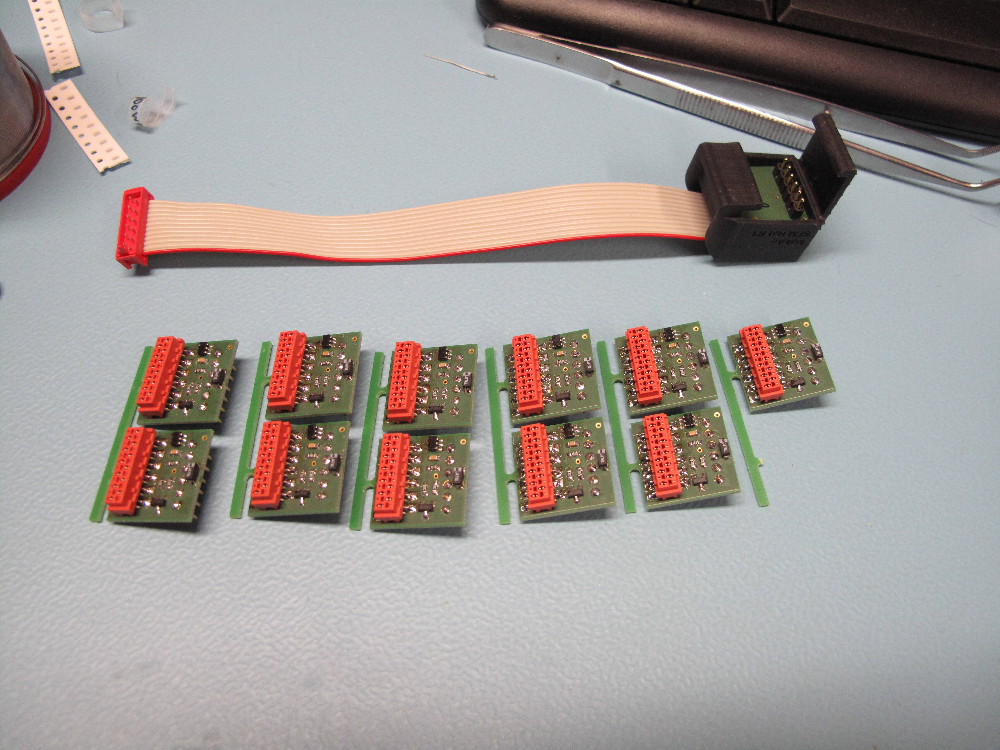

# MakAir Boards

## Components

| Part | Version | Last Changelog | Ready? | Schematics |
| ---- | ------- | -------------- | ------ | ---------- |
| [Pinch Valve Controller](./src/pinch-valve-controller) | V1 | Initial design | ✅ | [view schematic](./src/pinch-valve-controller/schematics/V1/1782SC001_01.pdf)
| [Raspberry Pi RTC](./src/raspberry-pi-rtc) | V1 | Initial design | ✅ | none
| [SFM 3300 Adapter](./src/sfm-3300-adapter) | V1 | Initial design | ✅ | none

## Renders

### The "Pinch Valve Controller"

xxx

### The "Raspberry Pi RTC"

  

### The "SFM 3300 Adapter"

  

